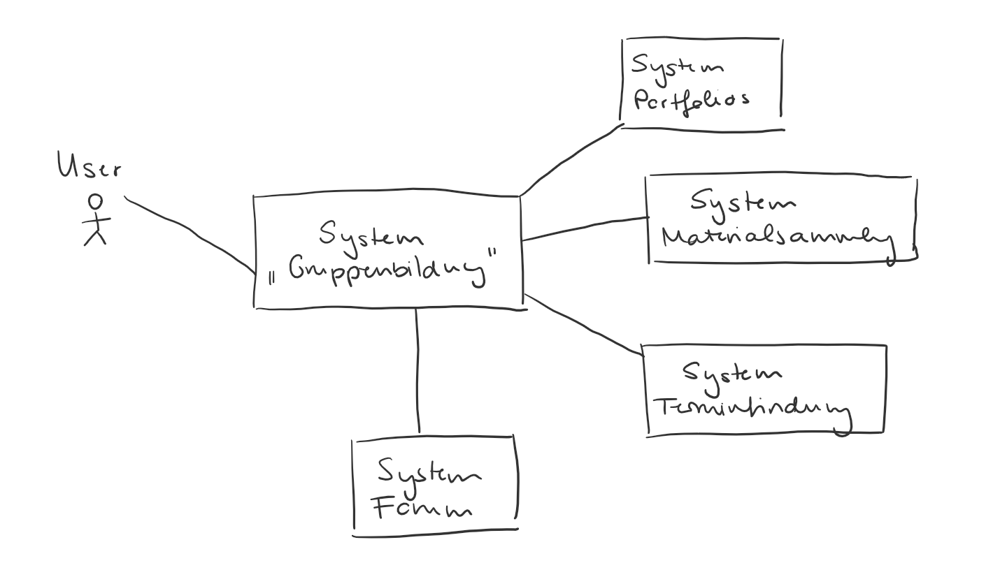

[[section-system-scope-and-context]]
== Kontextabgrenzung

=== Fachlicher Kontext

Das System wird vom User bedient. Externe Systeme, die Daten von unserem System anfordern, sind die angegebenen. Diese werden ebenfalls im Rahmen des Praktikums entwickelt.

=== Technischer Kontext

Das System erhält Authentifikationsinformationen von einem universitätsinternen Keycloak-Server. Damit können sich die User anmelden. Außerdem erhält es von den anderen Systemen die CSV-Dateien, die die Mitglieder, die einer Gruppe hinzugefügt werden sollen, angibt.

Die User erhält das System somit von Keycloak, den Input der externen Systeme in Form von CSV-Dateien.
