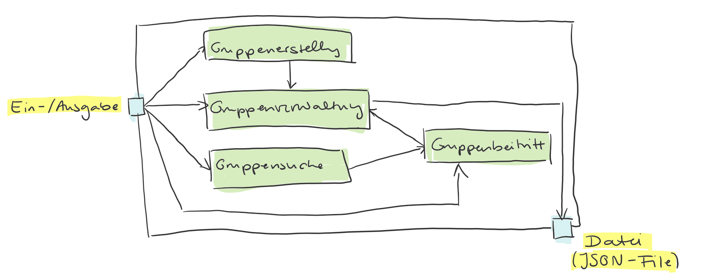
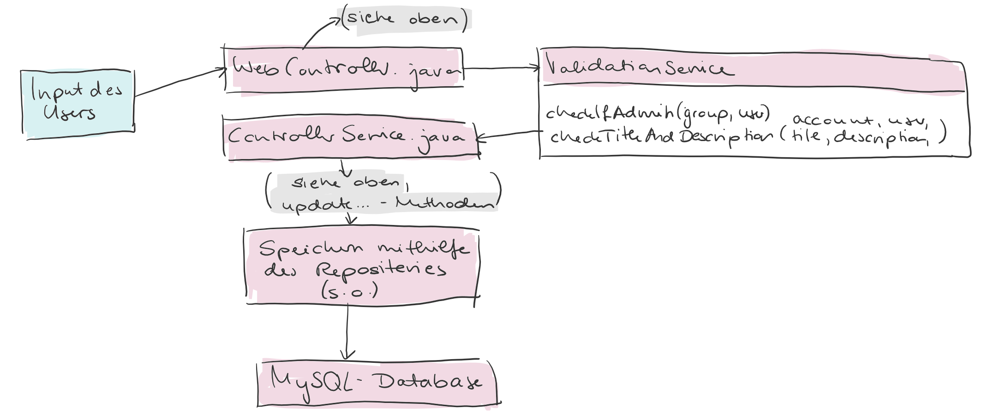
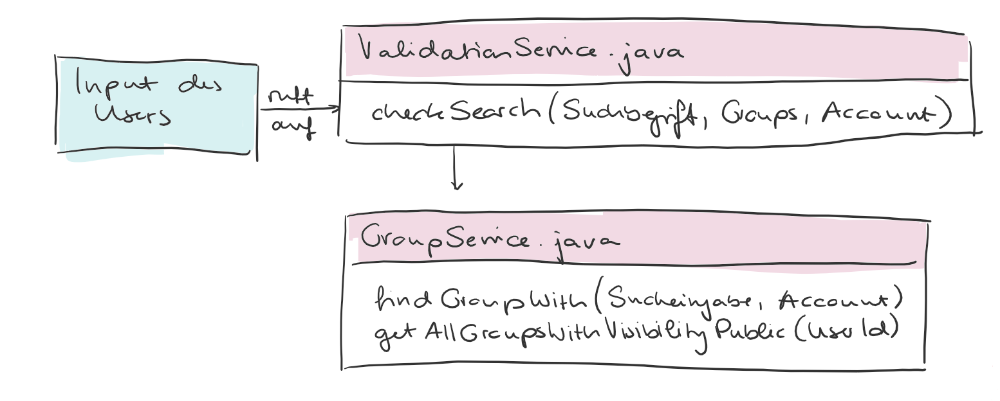
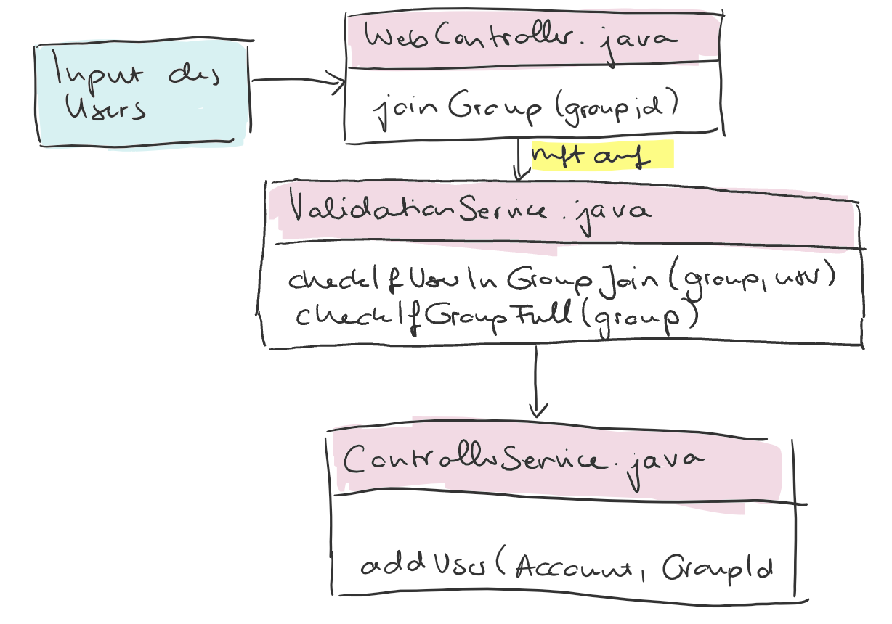

[[section-building-block-view]]
== Bausteinsicht

=== Whitebox Gesamtsystem

Begründung

Das System erhält vom User zunächst eine Eingabe in Form eines textuellen Inputs in ein Formular oder eines Knopfdrucks. Dieser Input wird, entsprechend seiner Art, an die Komponenten Gruppenerstellung, Gruppenverwaltung, Gruppensuche und Gruppenbeitritt gegeben.

Gruppenerstellung gibt die Information, dass eine Gruppe erstellt wurde, an die Gruppenverwaltung weiter, die Gruppen speichert und löscht.

Eine Eingabe direkt an die Gruppenverwaltung kann z.B. das Löschen einer Gruppe oder das Entfernen eines Users sein. Dies wird von der Gruppenverwaltung selbst durchgeführt.

Die Gruppensuche erhält als Input einen Suchbegriff, den der User eingibt.  Die Suche sucht dann mithilfe der Gruppenverwaltung die gespeicherten Gruppen, die den Suchbegriff beinhalten, heraus und zeigt sie dem User an.

Von der Suche aus kommt man zum Gruppenbeitritt. Dieser wird ebenfalls an die Gruppenverwaltung weitergeleitet und von ihr durchgeführt.

Wichtige Schnittstellen:: Die Kommunikation zwischen den Komponenten erfolgt mithilfe von Methodenaufrufen und den darin übergebenen Parametern.

==== Gruppenerstellung

image::whitebox_erstellen.png

Im obigen Diagramm sieht man eine detaillierte Ansicht des Vorgangs der Gruppenerstellung.

Zunächst wird der Input des Users, der in das Formular zur Gruppenerstellung eingetragen wird, vom WebController.java gemapped, also aufgezeichnet, und an den ControllerService.java weitergeleitet. Dort wird die Methode createGroup aufgerufen, falls es sich um eine Gruppe handelt, oder createOrga, falls eine Veranstaltung erstellt wird.
Beide Methoden erhalten einen Keycloak-Account, einen Gruppentitel, eine Beschreibung, die gewünschte Sichtbarkeit und die gewünschte maximale Teilnehmerzahl, bzw. die Information, dass die Teilnehmerzahl unbegrenz sein soll.

Innerhalb der beiden Methoden werden die Methoden updateTitle, updateDescription, addUser und updateRole aufgerufen. Diese erstellen sogenannte Events mit verschiedenen Eigenschaften.
Es wird ein CreateGroupEvent erstellt, das aussagt, dass eine Gruppe erstellt wird. Zu jeder Aktion, die beim Erstellen der Gruppe ausgeführt wird, wird ein Event erstellt, so z.B. auch ein AddUserEvent, wenn der Ersteller der Gruppe hinzugefügt wird, oder ein UpdateTitleEvent, wenn der Titel gesetzt wird. So wird zu jedem Attribut der Gruppe ein Event erstellt.

Diese Events werden in den EventService.java hineingegeben. Dieser ist dafür zuständig, das Event zu speichern und erledigt dies mithilfe der Methoden saveEvent und getEventDTO.

Das DTO wird weitergereicht an das EventRepository. Dies ist ein Interface, das von Java gestellte Methoden enthält, die die Kommunikation mit der Datenbank durch Queries erleichtern.
Durch die Methode save wird das DTO nun in der Datenbank gespeichert.

==== Gruppenverwaltung

Die Gruppenverwaltung funktioniert sehr ähnlich wie die Gruppenerstellung. Zunächst wird der Input vom WebController erfasst. Dieser wird aber zunächst an den ValidationService geleitet. Dieser prüft mithilfe der Methoden checkIfAdmin und checkTitleAndDescription, ob der User, der die Änderungen vornehmen möchte, berechtigt ist, dies zu tun, und ob er valide Eingaben abgesendet hat.

Wenn diese Eingaben korrekt sind, dann werden sie an den ControllerService weitergegeben. Dieser erstellt analog zur Gruppenerstellung die Events, die die Änderungen an den Gruppen speichern.
Diese Änderungen werden, ebenfalls analog, in die Datenbank gespeichert.

==== Gruppensuche

Bei der Gruppensuche wird, vergleichbar mit der Gruppenverwaltung, zunächst der Input geprüft. Wenn der Suchbegriff valide ist, also nicht leer, dann wird im GroupService entweder die Methode findGroupWith aufgerufen, die die Gruppen zurückgibt, die den Suchbegriff im Titel oder in der Beschreibung enthalten, oder die Methode getAllGroupsVisibilityPublic, die alle Gruppen zurückgibt, deren Sichtbarkeit öffentlich ist. Private Gruppen werden in der Gruppensuche nicht angezeigt.

==== Gruppenbeitritt

Hier wird der Input des Users in Form eines Knopfdrucks an den WebController geleitet. Dieser ruft dann den ValidationService auf, der den Vorgang mithilfe zweier Methoden prüft. Zunächst wird geprüft, ob der User bereits in der Gruppe ist. Wenn nicht, dann wird noch geprüft, ob die Gruppe bereits die maximale Teilnehmerzahl erreicht hat.

Wenn beides nicht der Fall ist, dann wird der ControllerService aufgerufen, der mithilfe der Gruppenverwaltung und des Erstellens eines AddUserEvents den neuen User in die Gruppe einfügt und die Änderung an die Datenbank vermittelt.

