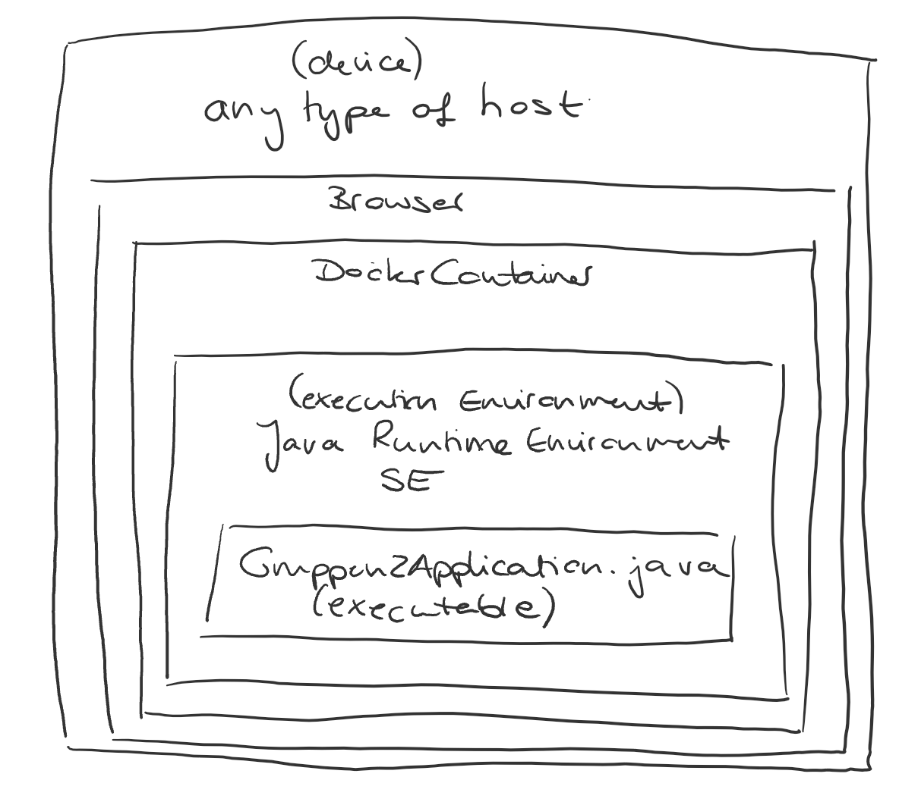

[[section-deployment-view]]
== Verteilungssicht

=== Infrastruktur

[cols="1,2" options="header"]
|===
|Komponente |Definition
|Java Application |Ausführbares Programm, mithilfe dessen sich die Anwendung starten lässt
|Java Runtime Environment SE |Umgebung, auf der das Programm läuft
|Docker Container |Beinhaltet die Anwendung und simuliert Betriebssystem, auf dem die Anwendung läuft. Enthält außerdem die Datenbank.
|Browser |Anwendung, die Zugang zum Internet ermöglicht
|Any type of host |Jedes Endsystem, das Zugriff auf einen Browser hat, kann die Gruppen2Application verwenden.
|===

