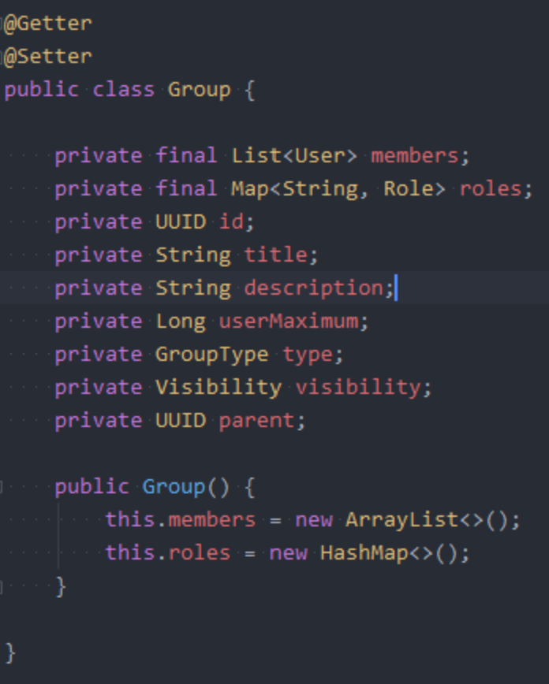

[[section-concepts]]
== Querschnittliche Konzepte

=== Benutzeroberfläche

Für die Benutzeroberfläche wurd Wert auf Einheitlichkeit und stimmige Farbgebung geachtet. Dies sieht man beispielsweise an der Darstellung der Details einer Gruppe:

Außerdem wird darauf geachtet, dass sich die Oberfläche selbst erklärt und dementsprechend intuitiv funktioniert, ohne, dass Erklärungen notwendig sind.

Ein Beispiel hierfür ist das Erstellen einer Gruppe:

image::frontend_2.png[]

Hier ist das Ausfüllen der Felder des Formulars selbsterklärend und eindeutig.

=== Event

Hier sieht man ein Beispiel für ein Event. Jedes Event ist eine Unterart der Oberklasse Event. Diese Events werden in der Datenbank gespeichert (s. 9. Entscheidungen, "Event Sourcing")

Jede Eventklasse überschreibt die Methode "applyEvent", sodass, je nach Eventtyp die richtige Aktion ausgeführt wird.

Hier sieht man das AddUserEvent, das einen User anhand seiner ID und Informationen einer Gruppe, die mithilfe einer ID identifiziert wird, hinzufügt.

Bevor dies geschieht, werden jedoch Validierungen ausgeführt, die prüfen, ob der User bereits Mitglied in der Gruppe ist und ob die maximale Mitgliederzahl bereits erreicht ist.
Wenn die Validierungen ohne Fehler verlaufen, dann wird dem User die Rolle "Mitglied" gegeben.

=== Validierung im Backend

Hier sieht man ein Beispiel für eine Validierung im Quellcode. Diese prüft, ob ein User Admin ist. Der User und die Gruppe werden in die Methode als Parameter übergeben.

Zunächst wird eine weitere Validierung innerhalb dieser durchgeführt, um zu prüfen, ob der angegebene User Mitglied der angegeben Gruppe ist. Dann wird die Rolle der Users innerhalb der Gruppe geprüft. Falls dieser kein Admin ist, dann wird die angegebene Exception ausgegeben.

=== Gruppe

Hier sieht man die Klassendefinition der Gruppe.
Die Attribute werden mithilfe von Lombok, einem Plugin, automatisch eingefügt.
