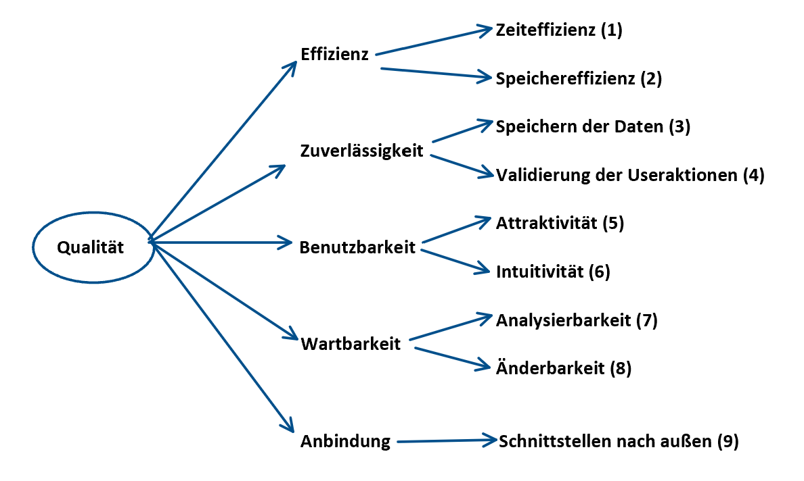

[[section-quality-scenarios]]
== Qualitätsanforderungen

=== Qualitätsbaum

=== Qualitätsszenarien

[cols="1,2" options="header"]
|===
|Qualitätsziele |Szenario
|1|Ein Student möchte einer Lerngruppe des Fachs Lineare Algebra 1 beitreten. Obwohl es insgesamt über 1000 Gruppen gibt, wird die Suche in angemessener Zeit durchgeführt und die passenden Ergebnisse angezeigt.
|1|Die Leitung der Fachrichtung Informatik möchte eine Gruppe mit allen Studenten des Fachs erstellen, um regelmäßig wichtige Informationen verteilen zu können. Der Leiter der Fachrichtung kann mithilfe einer CSV-Datei, in der die über 5000 Studenten gelistet sind, die Studenten schnell und zuverlässig hinzufügen.
|2, 3 |Die Universität verwaltet mithilfe des Moduls Gruppenbildung sehr viele verschiedene Gruppen, was zu einer hohen Belastung des Speichers der Universitätsserver führen kann, wenn die Gruppen nicht richtig verwaltet werden. Da aber die Gruppen ohne Mitglieder automatisch gelöscht werden und auch von Usern manuell gelöscht werden können, findet kein unnötiger Speicherverbrauch statt.
|3, 4 |Ein Student, der neu an der Universität ist, gibt aus Versehen im Formular zur Gruppenerstellung fehlerhafte Daten ein und setzt weder einen Haken, der die unbegrenzte Anzahl der Mitglieder gewährleistet, noch eine maximale Mitgliederanzahl. Da aber sowohl im User Interface als auch in der Geschäftslogik Validierungen durchgeführt werden, gelangen keine fehlerhaften Objekte in die Datenbank und Fehler werden verhindert.
|5 |Die Universität legt seit Jahren Wert auf ein modernes Auftreten und hat kürzlich sowohl das eigene Logo, als auch die Studentenausweise modernisiert. Demnach ist eine entsprechende Anforderung an moderner Optik an die Software gestellt, die die Studenten verwenden sollen. Aufgrund des einheitlichen und modernen Aussehens passt die Oberfläche des Moduls "Gruppenbildung" in das Image der Universität.
|5, 6 |Ein neuer Mathematik-Student, der nicht viel Erfahrung mit PCs und digitalen Formularen hat, sucht eine Lerngruppe im Fach Analysis, um die gelernten Inhalte zu wiederholen. Dank der intuitiven Benutzeroberfläche findet er sich im Modul gut zurecht und kann eine Gruppe nach seinen Vorstellungen erstellen.
|6, 7 |Ein neuer Mitarbeiter der IT-Abteilung soll in das Modul eingeführt werden und sich in Zukunft um die Wartung kümmern. Weil der Code gut auskommentiert und die Variablen sinnvoll benannt sind, findet er sich in der Software zurecht und braucht nicht lange, bis er mit der Arbeit beginnen kann.
|7 |Der Dozent des Fachs "Programmierpraktikum" möchte anhand eines Beispiels die Arbeit Teams im 2. Praktikum und das Ergebnis, was erzielt werden kann, darstellen. Dafür zeigt er Teile des Codes und erläutert kurz die Logik, die den Studenten leicht verständlich ist.
|7, 8 |Ein Student hat einen Bug in der Software gefunden und diesen der IT-Abteilung gemeldet. Da sich der neue Mitarbeiter der Abteilung schnell in den Code eingefunden hat, kann er den Fehler beheben, ohne viel Zeit zu investieren.
|7, 8 |Die Leitung der Universität möchte ein neues Feature in das Modul "Gruppenbildung" einfügen, und zwar sollen die Mitglieder nicht mehr über eine CSV-Datei, sondern über ein anderes tabellarisches Datenformat eingefügt werden. Weil es nur wenige Abhängigkeiten im Code gibt, kann das  Feature problemlos eingefügt werden.
|9 |Eine neue Komponente soll ins MOPS-Modul eingefügt werden. Es soll Gruppen annehmen und die Abgabe von Übungsblättern in diesen Gruppen verwalten. Die Schnittstelle der "Gruppenbildung" ist einfach gehalten, weshalb die Anbindung eines neuen Moduls problemlos funktioniert.
|===